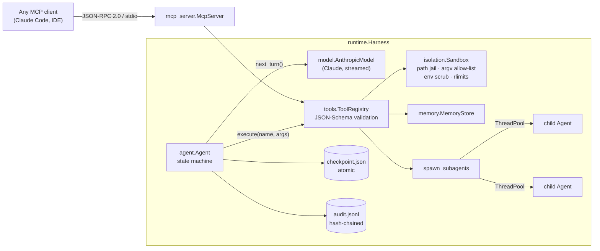

# longrun

**A harness that lets a coding agent work for hours without being trusted.**
Kill it mid-run and it resumes from the last checkpoint. Fan work out to parallel subagents. Keep it
off production: every path is jailed, every command is allow-listed, and every attempt lands in a
tamper-evident audit log.

```
agent loop ──▶ path jail ──▶ checkpoint ──▶ audit log
 the model      every path     saved after     every attempt,
 asks for a     checked        every step      hash-chained
 tool           first
```

Pure Python standard library + the official [`anthropic`](https://github.com/anthropics/anthropic-sdk-python) SDK.
74 tests (`unittest`), 92% branch coverage, `mypy --strict` clean.

---

## The 30-second demo: `kill -9`, then resume

The demo runs offline against a scripted model, so no API key is needed.

```console
$ longrun run "Fix the failing test" --workspace ws --script examples/fix-bug.script.json --run-id demo
21:45:57 [demo] step 1: tool_use list_dir
21:45:57 [demo] step 2: tool_use read_file, read_file
21:45:58 [demo] step 3: tool_use run_command
$ kill -9 %1                                   # pull the plug mid-run

$ longrun resume demo --script examples/fix-bug.script.json
21:45:59 [demo] resuming at step 3
21:45:59 [demo] step 4: tool_use run_command   # ← tries `curl https://api.prod.internal` … denied
21:46:00 [demo] step 5: tool_use write_file
21:46:01 [demo] step 6: tool_use run_command
21:46:01 [demo] step 7: tool_use remember
21:46:01 [demo] done after 8 steps

Fixed an off-by-one in calc.mean (removed the stray `- 1`). Verified: `python -m unittest -v` passes (1 test).

$ longrun verify demo
[ok ] demo: 36 records

$ longrun log demo | grep -E 'resume|denied'
   16 21:45:59 run.resume
   20 21:45:59 tool.denied       run_command      denied: command not allowed: curl https://api.prod.internal/metrics
```

Or run the whole sequence with `make demo`. The same scenario runs in CI as a test that sends a real
`SIGKILL` to a real process ([`tests/test_kill_resume.py`](tests/test_kill_resume.py)).

---

## What it guarantees, and how each guarantee is tested

| Guarantee | Mechanism | Proven by |
|---|---|---|
| **Resume after any crash.** A run killed at any instant continues to the same result. | Atomic checkpoint (temp file → `fsync` → `os.replace` → `fsync` dir) after every model turn **and** every tool call | `test_resume_after_crash_between_steps_matches_clean_run` crashes at every step and checks the final transcript is identical; `test_sigkill_then_resume_finishes_the_job` uses a real `kill -9` |
| **Side effects run at most once.** A tool killed mid-call is never silently replayed. | `tool.start` is audited before execution; the result is checkpointed *before* `tool.end`. On resume, an unclosed start means "outcome unknown", reported to the model as `interrupted` | `test_side_effecting_tool_killed_mid_call_is_not_replayed`; read-only tools marked `idempotent` are safely re-run (`test_idempotent_tool_killed_mid_call_is_rerun`) |
| **Paths can't escape the workspace.** | Resolve (following symlinks) → must be under root. `..`, absolute paths, symlink escapes, NUL bytes, `.env*` and writes to `.git/` are all denied, in code, before any I/O | `PathJailTests` (12 cases, including a symlink pointing outside) |
| **Commands can't reach prod.** | No shell; argv must start with an allow-listed prefix; path-like args are jailed; **scrubbed environment** (no API keys or cloud creds inherited); timeout kills the whole process group; `RLIMIT_CPU/FSIZE/NOFILE` | `CommandTests`: `curl`, `git push`, `bash -c` denied; secret env var not visible to child; grandchild killed on timeout |
| **The audit log is tamper-evident.** | JSONL where each record carries `sha256(prev record)`; `fsync` per append; a torn last line from a crash is repaired on open | `test_editing_a_record_is_detected`, `test_deleting…`, `test_rehashing_an_edited_record_still_breaks_the_next_link`, `test_torn_tail_is_repaired…`, 8-thread concurrent append |
| **Fan-out survives crashes too.** | Child run ids are derived from the parent's `tool_use_id`, so a resumed parent re-enters the same call, skips finished children and resumes unfinished ones | `test_crash_mid_fan_out_resumes_only_unfinished_children` |
| **The agent can't edit its own records.** | Checkpoints, audit logs and memory live in a state dir that must be outside the jail (enforced at startup) | `test_usage_errors` |

---

## Architecture



One loop iteration, with the checkpoint and audit writes shown in order:

```
model.request ─▶ Claude ─▶ model.response ─▶ CHECKPOINT (pending tool calls)
   for each call:  tool.start ─▶ sandbox ─▶ CHECKPOINT (result) ─▶ tool.end | tool.denied
   all results ─▶ one user message ─▶ CHECKPOINT ─▶ next turn
```

[`DESIGN.md`](DESIGN.md) walks through every crash window (what happens if the process dies between
any two of those writes) and the other design decisions.

| Module | Responsibility | LOC |
|---|---|---|
| [`agent.py`](src/longrun/agent.py) | The loop: model turn → tool calls → results, checkpointed at each transition | ~175 |
| [`isolation.py`](src/longrun/isolation.py) | Path jail and subprocess sandbox | ~250 |
| [`checkpoint.py`](src/longrun/checkpoint.py) | `RunState` + atomic, versioned persistence | ~130 |
| [`audit.py`](src/longrun/audit.py) | Hash-chained, crash-repairing JSONL log + verifier | ~145 |
| [`runtime.py`](src/longrun/runtime.py) | Wiring, system prompt, checkpointed subagent fan-out | ~200 |
| [`tools.py`](src/longrun/tools.py) | Tool registry, schema validation, built-in tools | ~210 |
| [`mcp_server.py`](src/longrun/mcp_server.py) | MCP server over stdio, written directly against JSON-RPC 2.0 | ~130 |
| [`model.py`](src/longrun/model.py) | Claude backend + deterministic scripted backend | ~135 |
| [`memory.py`](src/longrun/memory.py) | Long-term key/value memory shared across runs | ~80 |

---

## Quickstart

```bash
git clone <this repo> && cd longrun
python -m venv .venv && source .venv/bin/activate
pip install -e ".[dev]"
make demo
```

```bash
make check
```

That runs lint, `mypy --strict`, and the full test suite with coverage.

### Real runs with Claude

```bash
export ANTHROPIC_API_KEY=...
longrun run "Add input validation to calc.mean and a test for the empty list" --workspace path/to/repo
```

* Uses `claude-opus-5` with adaptive thinking, streaming, and prompt caching. The conversation prefix is
  kept byte-stable (sorted tools, system prompt frozen into the checkpoint), so each step reads the
  previous ones from cache.
* Opts into server-side refusal fallbacks. The `refusal`, `max_tokens` (truncated tool input is never
  executed) and transient-error cases all leave a resumable checkpoint.
* Subagents use the same model at `--subagent-effort medium` by default.

```bash
longrun status
longrun log <run-id>
longrun verify <run-id>
longrun resume <run-id>
```

`status` lists runs and their subagents, `log` prints the audit trail, `verify` checks the hash chain
(parent and children), and `resume` continues a run after a crash, Ctrl-C, or an API outage.

Extend the allow-list per run with `--allow "git commit" --allow "npm test"`. Wrap every command in an
OS sandbox with `--launcher "bwrap --unshare-net --ro-bind / / --bind $PWD $PWD"` (see the threat model).

### Use the jailed tools from Claude Code (MCP)

```bash
claude mcp add longrun -- longrun mcp --workspace /path/to/repo
```

Any MCP client then gets `read_file`, `write_file`, `list_dir`, `run_command`, `remember` and `recall`,
with the same jail and the same audit log.

---

## Threat model

**Defends against:** a well-meaning but wrong agent, and prompt injection in files it reads. Concretely,
it blocks writes outside the workspace, reading secrets (`.env*`, files outside the root), tampering with
`.git/` hooks, running non-allow-listed binaries (`curl`, `ssh`, `kubectl`, `git push`…), inheriting
credentials through the environment, fork-bombs and runaway output, and covering its tracks in the audit
log.

**Does not, on its own, defend against:** code that an *allowed* interpreter runs. `python` is
allow-listed by default because a coding agent has to run tests, and a Python process can open sockets
or read any file the OS user can. The sandbox is a policy layer, not a kernel boundary. For untrusted
workloads, add a `--launcher` that provides one (bubblewrap/`unshare -n` on Linux, a container, or
`sandbox-exec` on macOS), or remove `python` from the allow-list. The audit log is tamper-*evident*, not
tamper-*proof*: someone with write access to the state dir can rewrite the whole chain. Ship the head hash
somewhere append-only if that matters.

---

## Project layout

```
src/longrun/         the package (13 modules, typed, py.typed)
tests/               unittest suite: unit, crash-injection, real SIGKILL, MCP over stdio
examples/            buggy-project/ + fix-bug.script.json used by the demo and the e2e test
DESIGN.md            crash-window analysis and design decisions
.github/workflows/   CI: ruff, mypy --strict, tests on Linux + macOS, Python 3.10–3.13
```

## License

MIT
